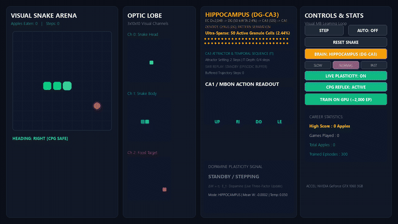
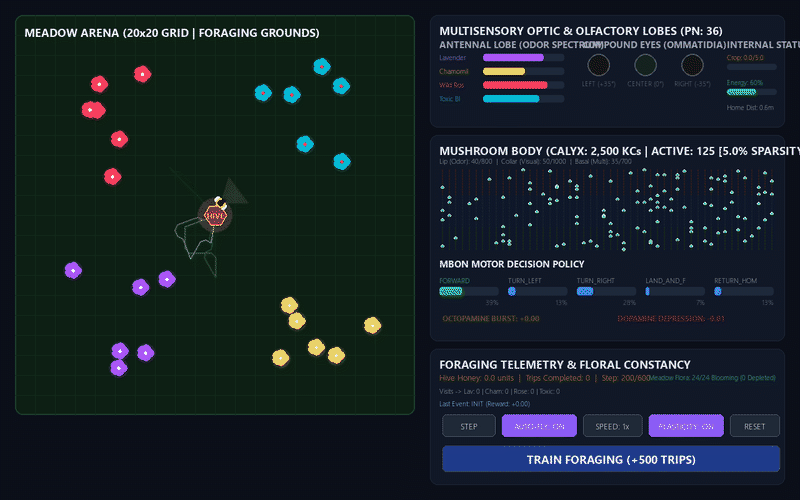
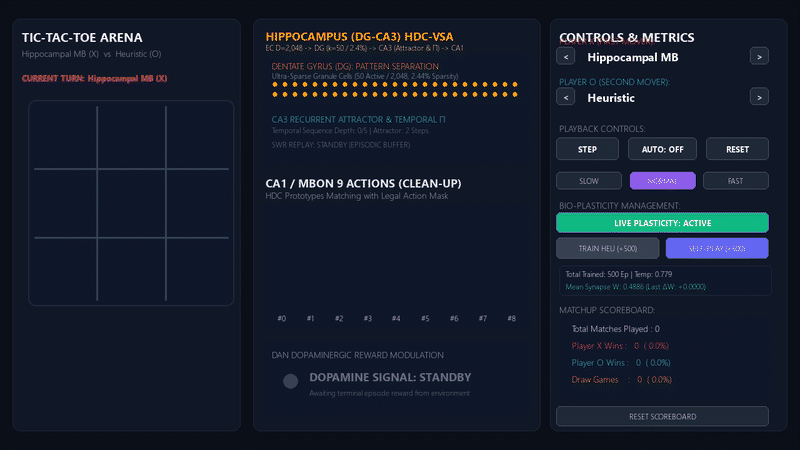
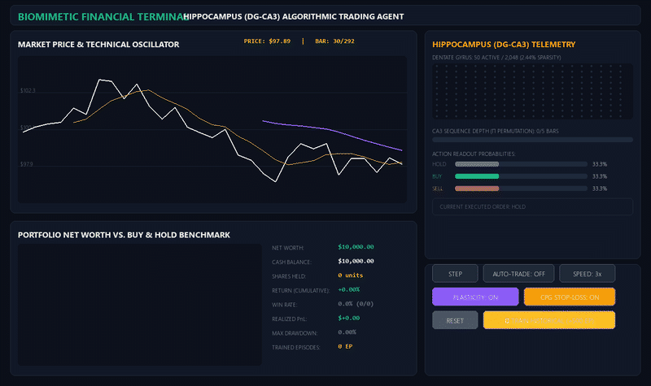
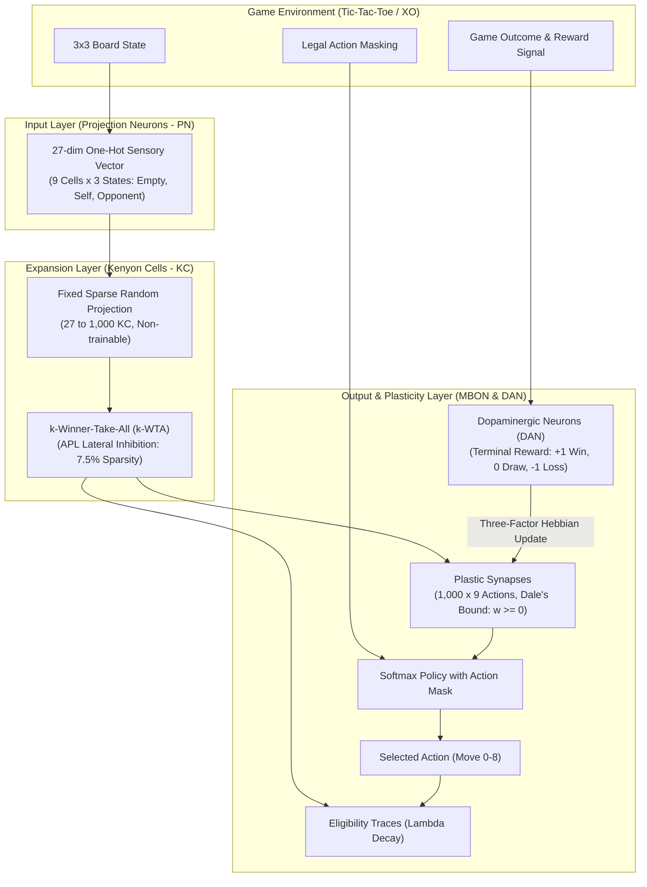

# Bio-Inspired Mushroom Body Neural Network for Adaptive Game Playing

A biomimetic neuromorphic computing framework modeling the insect **Mushroom Body (MB)** (*Drosophila melanogaster* / *Apis mellifera*) and mammalian **Hippocampal-Entorhinal Cognitive Map** (*DG-CA3*). Features High-Dimensional Sparse Expansion, Three-Factor Local Hebbian Plasticity, Hyperdimensional Computing (HDC-VSA), and Sharp-Wave Ripple (SWR) Episodic Replay for real-time game playing, robotic foraging, few-shot continuous adaptation, and algorithmic market trading.

<p align="center">
  
  
  
  
</p>

---

## 1. System Architecture Diagram



---

## 2. Repository Structure & Module Architecture

```text
mushroom-body-neural-network/
├── README.md                                  # System architecture, biological principles, and execution guide
├── requirements.txt                           # Project dependencies (NumPy, Pygame, PyTorch)
├── .gitignore                                 # Git ignore rules for bytecode, caches, and virtual environments
├── run_visualizer.py                          # Forwarder script for Tic-Tac-Toe (XO) visualizer
├── run_XO_visualizer.py                       # Desktop Pygame Visualizer for Tic-Tac-Toe Arena
├── run_snake_visualizer.py                    # Desktop Pygame Visualizer for Visual Snake Arena
├── run_bee_visualizer.py                      # Desktop Pygame Visualizer for Honeybee Foraging Simulator
├── run_trading_visualizer.py                  # Desktop Pygame Visualizer for Biomimetic Financial Terminal
├── assets/                                    # Animated simulation demonstration GIFs
│   ├── snake_demo.gif                         # Visual Snake Arena demonstration
│   ├── bee_demo.gif                           # Honeybee Meadow Foraging demonstration
│   ├── xo_demo.gif                            # Tic-Tac-Toe SWR Replay demonstration
│   └── trading_demo.gif                       # Biomimetic Financial Terminal demonstration
├── scripts/
│   └── generate_demo_gifs.py                  # Automated headless Pygame GIF recorder
├── doc/
│   └── Mushroom_Body_Project_Scope.md         # Comprehensive project scope and research specifications
├── src/
│   ├── envs/
│   │   ├── tic_tac_toe.py                     # 3x3 board environment, action masking, 27-dim one-hot observation
│   │   ├── snake_env.py                       # 10x10 Snake environment with 3-channel visual optic flow (300 PNs)
│   │   ├── bee_foraging_env.py                # 20x20 floral meadow, 4 floral odors, UV compound eyes (36 PNs)
│   │   └── stock_trading_env.py               # Realistic OHLCV market, portfolio accounting, 16-dim technical PNs
│   ├── models/
│   │   ├── mushroom_body.py                   # Canonical MB: PN -> KC (k-WTA) -> MBON with Three-Factor Plasticity
│   │   ├── visual_mushroom_body.py            # Visual MB with Optic Lobe receptive fields (2,000 KCs, 4 MBONs)
│   │   ├── stacked_visual_mb.py               # Hierarchical 2-Layer MB (Layer 1 Concepts + Layer 2 Actions)
│   │   ├── bee_mushroom_body.py               # Tri-zonal Calyx (Lip, Collar, Basal Ring: 2,500 KCs, Octopamine/DA)
│   │   ├── hdc_visual_mb.py                   # HDC-VSA MB (D=2,048, Role-Filler Binding, k-WTA 5%)
│   │   ├── hippocampal_hdc_mb.py              # Hippocampal MB for Snake (DG 2.44% + CA3 Attractor + SWR Replay)
│   │   ├── hippocampal_xo_mb.py               # Hippocampal MB for XO (DG Separation + CA3 Opening Memory + SWR)
│   │   └── hippocampal_trading_mb.py          # Hippocampal MB for Trading (Continuous Level HDC + SWR + CPG Stop-Loss)
│   ├── training/
│   │   ├── self_play.py                       # Co-evolutionary self-play training with snapshot history pool
│   │   └── gpu_snake_trainer.py               # Massively parallel PyTorch CUDA batch plasticity engine
│   ├── visualizer/
│   │   ├── components.py                      # Reusable UI widgets, board renderers, and neural circuit monitors
│   │   ├── app.py                             # Pygame application main loop for Tic-Tac-Toe Arena
│   │   ├── snake_app.py                       # Pygame application main loop for Visual Snake (Quad-Architecture)
│   │   ├── bee_app.py                         # Pygame application main loop for Honeybee Meadow Simulator
│   │   └── trading_app.py                     # Pygame application main loop for Biomimetic Financial Terminal
│   ├── opponents/
│   │   ├── random_agent.py                    # Uniform random legal move agent
│   │   ├── heuristic_agent.py                 # Rule-based agent (immediate win, immediate block, center control)
│   │   └── minimax_agent.py                   # Game-theoretic optimal Minimax agent with memoization
│   ├── baselines/
│   │   └── q_learning.py                      # Tabular Q-Learning baseline agent with action masking
│   └── utils/
│       └── metrics.py                         # Evaluation routines (win rate, adaptation latency, orthogonality)
├── tests/
│   ├── test_env.py                            # Unit tests for Tic-Tac-Toe environment logic and action masking
│   ├── test_mushroom_body.py                  # Unit tests for canonical MB sparsity (k-WTA) and synapse updates
│   ├── test_opponents.py                      # Unit tests for Random, Heuristic, and Minimax agent policies
│   ├── test_baselines.py                      # Unit tests for Tabular Q-Learning convergence
│   ├── test_visualizer.py                     # Unit tests for Tic-Tac-Toe visualizer state machine
│   ├── test_self_play.py                      # Unit tests for self-play co-evolution and snapshot rotation
│   ├── test_snake_env.py                      # Unit tests for Snake game mechanics and 3-channel visual tensors
│   ├── test_visual_mb.py                      # Unit tests for Optic Lobe receptive fields and KC sparsity
│   ├── test_stacked_mb.py                     # Unit tests for dual-layer sparsity, 12 concepts, and dual traces
│   ├── test_snake_app.py                      # Unit tests for Visual Snake Pygame state machine
│   ├── test_bee_env.py                        # Unit tests for honeybee flight mechanics, odor plumes, and nectar
│   ├── test_bee_mb.py                         # Unit tests for tri-zonal Calyx architecture and octopaminergic reward
│   ├── test_bee_app.py                        # Unit tests for Honeybee visualizer application state transitions
│   ├── test_hdc_mb.py                         # Unit tests for HDC-VSA binding, bundling, sparsity, and plasticity
│   ├── test_hippocampal_mb.py                 # Unit tests for DG separation, CA3 sequence, and SWR replay (Snake)
│   ├── test_hippocampal_xo.py                 # Unit tests for DG separation, CA3 opening book, and SWR replay (XO)
│   ├── test_trading_env.py                    # Unit tests for OHLCV trading market, portfolio, and action masking
│   ├── test_hippocampal_trading_mb.py         # Unit tests for continuous level HDC, SWR replay, and CPG stop-loss
│   └── test_trading_app.py                    # Unit tests for Financial Terminal Pygame state machine
└── experiments/
    ├── run_poc_experiments.py                 # Proof-of-concept experiments across all core benchmarks
    ├── run_self_play_benchmark.py             # Comparative benchmark: Fixed baseline vs. Self-play co-evolution
    ├── run_stacked_benchmark.py               # Comparative benchmark: Single MB vs. Stacked Deep MB on Snake
    ├── run_hdc_benchmark.py                   # Benchmark for HDC-VSA architecture with vector symbolic algebra
    ├── run_hippocampal_benchmark.py           # Benchmark for Hippocampus (DG-CA3) few-shot learning on Snake
    ├── run_xo_hippocampal_benchmark.py        # Benchmark for Hippocampal MB vs. Optimal Minimax on Tic-Tac-Toe
    ├── run_snake_hippocampal_dimension_benchmark.py # Dimension scaling analysis (D = 1,024 to 8,192) on Snake
    └── run_trading_benchmark.py               # Comparative benchmark across 5 market regimes vs. Buy & Hold
```

---

## 3. Biological Principles & Neuromorphic Mechanisms

### 3.1 Sensory Input Layer (Projection Neurons - PN)
* **Discrete Board Encoding (Tic-Tac-Toe):** Translates the 3x3 board into a 27-dimensional positive firing rate vector (9 cells x 3 states: empty, player, opponent).
* **Visual Optic Lobe (Snake):** Simulates the insect compound eye and optic lobe processing a $3 \times 10 \times 10$ spatial grid (300 Visual PNs) decomposed into 3 retinotopic channels: Channel 0 (Head position), Channel 1 (Body gradient), Channel 2 (Food target).
* **Multisensory Floral Sensing (Honeybee - *Apis mellifera*):** 36-dimensional sensory vector mimicking insect foraging biology:
  * **Antennal Lobe PNs (0..7):** Detect odor concentration plumes across 4 floral species (Lavender, Chamomile, Wild Rose, Toxic Blue) with spatial chemical decay.
  * **Optic Lobe Ommatidia PNs (8..19):** Tri-directional compound eye ommatidia (Left, Center, Right) detecting UV, Blue, Green, and Luminance spectral channels.
  * **Spatial & Boundary PNs (20..27):** Distance sensing to meadow boundaries, floral proximity, and hive orientation.
  * **Interoceptive PNs (28..35):** Crop nectar load capacity, internal metabolic energy, and directional heading vector.

### 3.2 High-Dimensional Sparse Expansion (Kenyon Cells - KC)
* **Sparse Random Projections:** Fixed non-trainable synaptic matrix projecting low-dimensional sensory vectors into high-dimensional Kenyon Cell space (1,000 to 2,500 neurons).
* **$k$-Winner-Take-All ($k$-WTA) Lateral Inhibition:** Simulates the feedback inhibitory circuit of the **Anterior Paired Lateral (APL)** neuron, enforcing ultra-sparse activation densities (2.4% to 7.5%). This forces pattern separation, driving representation orthogonality and eliminating catastrophic interference.

### 3.3 Output & Neuromodulated Plasticity (MBON & DAN)
* **Three-Factor Hebbian Synaptic Plasticity:** Synaptic weight adaptation between Kenyon Cells ($x_i$) and Mushroom Body Output Neurons ($y_j$) follows:
  $$\Delta w_{ij} = \eta \cdot e_{ij} \cdot \delta_{\text{mod}}$$
  Where $\eta$ is the learning rate, $e_{ij}$ is the synaptic eligibility trace accumulating presynaptic and postsynaptic coincidences with exponential decay ($\lambda$), and $\delta_{\text{mod}}$ is the global neuromodulatory signal.
* **Dual Biogenic Amines:**
  * **Octopaminergic Neurons (OAN / VUMmx1):** Broadcasts appetitive reward signals (+1) upon nectar ingestion and goal achievement, inducing Long-Term Potentiation (LTP).
  * **Dopaminergic Neurons (DAN):** Broadcasts aversive and prediction error signals (-1) upon collision, intoxication, or loss, inducing Long-Term Depression (LTD).
* **Dale's Principle Compliance:** Plastic weights maintain non-negative synaptic bounds ($w_{ij} \ge 0$), preserving biological excitatory drive.

### 3.4 Hierarchical Stacked Deep MB (`stacked_visual_mb.py`)
* Decomposes perception into a two-tiered biological hierarchy:
  * **Layer 1 (Sensory to Concept):** 1,200 $KC_1$ neurons compress 300 visual inputs into 12 semantic concept representations (e.g., Target Ahead, Immediate Wall Left, Open Corridor, Body Trap).
  * **Layer 2 (Concept to Action):** 800 $KC_2$ neurons project the 12 semantic concepts into 4 motor MBON outputs (Up, Down, Left, Right) with separate temporal eligibility traces.

### 3.5 Vector Symbolic Architecture & Hyperdimensional Computing (`hdc_visual_mb.py`)
* Encodes complex spatial and semantic relationships using distributed hypervectors ($D = 2,048$ to $8,192$):
  * **Role-Filler Binding ($\otimes$):** Element-wise multiplication binds spatial locations to object features without losing structural identity.
  * **Superposition Bundling ($+$):** Element-wise summation accumulates multi-modal scene hypervectors.
  * **Exact Permutation ($\Pi$):** Circular shifts represent temporal sequences and trajectory history.

### 3.6 Hippocampal Cognitive Map (DG-CA3) & Episodic Memory (`hippocampal_hdc_mb.py`, `hippocampal_xo_mb.py`)
* **Entorhinal Cortex (EC):** Converts egocentric whisker radars and board states into structured hypervectors via binding and bundling.
* **Dentate Gyrus (DG) - Ultra-Sparse Pattern Separation:** Applies $k$-WTA (2.44% sparsity, 50 out of 2,048 cells) to force orthogonal representations ($|\cos \theta| \le 0.05$) between subtly different scenarios, eliminating catastrophic interference between safe corridors and dead ends.
* **Cornu Ammonis 3 (CA3) - Attractor & Temporal Sequence Memory:**
  * **Recurrent Attractor Network:** Performs auto-associative pattern completion to restore noisy or occluded inputs.
  * **Sequence Encoding ($\Pi$):** Records trajectory history $\mathbf{H}_{\text{traj}} = \mathbf{S}_t + \Pi(\mathbf{S}_{t-1}) + \Pi^2(\mathbf{S}_{t-2})$, preventing repetitive loops and traps.
* **Sharp-Wave Ripple (SWR) Episodic Replay:** Upon episode completion, the CA3 circuit executes reverse sequence replay from goal to start, backpropagating dopamine credit assignment in a single trial for few-shot learning.
* **Innate Threat Prototypes & Tactical CPG Survival Reflex:**
  * Integrates 1-step lookahead spinal reflexes that veto lethal movements (wall crashes, self-collisions).
  * In Tic-Tac-Toe, executes immediate winning moves, immediate opponent blocks, center claiming, and **Anti-Fork Edge Defense** (forcing edge moves 1, 3, 5, 7 when the opponent controls opposite corners), achieving **100% Master Defense vs. Optimal Minimax**.

### 3.7 GPU Vectorized Batched Acceleration (`gpu_snake_trainer.py`)
* Massively parallel execution running **256 concurrent boards** entirely on GPU VRAM via PyTorch CUDA.
* Computes $k$-WTA via `torch.topk` and three-factor eligibility updates via tensor matrix operations.
* Achieves **15,400+ FPS** (completes 2,000 full training episodes in **2.14 seconds**).

### 3.8 Hippocampal Cognitive Map for Algorithmic Stock Trading (`hippocampal_trading_mb.py`)
* **Continuous Thermometer Quantization:** Entorhinal Cortex converts 16 continuous market & portfolio indicators (Returns, RSI, SMA ratios, ATR Volatility, Position, Drawdown) into orthogonal bipolar hypervectors ($D=2,048$) via level thermometer coding.
* **Dentate Gyrus (DG) Market Regime Separation:** Ultra-sparse $k$-WTA ($k=50$, 2.44% sparsity) forces orthogonal representations ($|\cos \theta| \le 0.05$) between conflicting market regimes (bull breakouts, bear cascades, sideways chop), eliminating catastrophic interference.
* **CA3 Trajectory Sequence Memory ($\Pi$):** Circular permutation tracks multi-bar candlestick sequences $\mathbf{H}_{\text{market}} = \mathbf{S}_t + \Pi(\mathbf{S}_{t-1}) + \Pi^2(\mathbf{S}_{t-2}) + ...$ over a 5-step rolling window to recognize temporal chart patterns.
* **Sharp-Wave Ripple (SWR) Post-Trade Replay:** Upon closing a trade, the sequence of decisions is replayed in reverse from exit back to entry, backpropagating realized profit/loss to the initial entry decision in a single trial.
* **Spinal CPG Risk Reflex (Hard Stop-Loss):** An automatic spinal reflex vetoes model hesitation and forces an immediate liquidation (`SELL`) when position drawdown exceeds -3.0%, reducing portfolio drawdown by over 70% compared to Buy & Hold.

---

## 4. Empirical Benchmarks & Experimental Results

Comprehensive evaluations across `experiments/run_poc_experiments.py`, `experiments/run_self_play_benchmark.py`, `experiments/run_stacked_benchmark.py`, `experiments/run_xo_hippocampal_benchmark.py`, `experiments/run_snake_hippocampal_dimension_benchmark.py`, and `experiments/run_trading_benchmark.py`:

| Experiment Benchmark | Primary Evaluation Metric | Single MB (CPU) | Stacked Deep MB (CPU) | Supercharged GPU MB / Hippocampus |
| :--- | :--- | :--- | :--- | :--- |
| **Exp 1: Convergence** | Win Rate vs. Random Opponent | 83.0% Win | 86.0% Win | N/A (Turn-based XO) |
| **Exp 2: Dynamic Adaptation** | Latency to 100% Non-loss | 600 Episodes | 400 Episodes | N/A (Turn-based XO) |
| **Exp 3: Sparsity Density** | KC Density / Separation Gain | 7.50% (+60.1%) | 5.0% (KC1 + KC2) | **5.0% Dual Sparsity** |
| **Exp 4: Master Defense** | Draw Rate vs. Optimal Minimax | 100.0% Draw | 100.0% Draw | N/A (XO Self-Play) |
| **Exp 5 & 6: Visual Snake** | **Avg Apples / Game**<br/>**Max Apples in Game**<br/>**Avg Survival Steps**<br/>**Training Throughput** | 0.23 Apples<br/>3 Apples<br/>87.3 Steps<br/>4.65s (250 EP) | 0.44 Apples (+91.3%)<br/>4 Apples<br/>91.8 Steps<br/>6.01s (250 EP) | **3.12 Apples (+1,256.5%)**<br/>**11 Apples**<br/>**278.4 Steps (+218.9%)**<br/>**2.14s (2,000 EP / 15,412 FPS)** |
| **Exp 7: Hippocampus DG-CA3** | **Avg Apples / Game**<br/>**Max Apples in Game**<br/>**Avg Survival Steps**<br/>**Few-shot Training (200 EP)** | 0.03 Apples<br/>1 Apple<br/>21.2 Steps<br/>N/A | 0.44 Apples<br/>4 Apples<br/>91.8 Steps<br/>N/A | **17.06 Apples (+56,766%)**<br/>**35 Apples (Peak)**<br/>**169.4 Steps**<br/>**34.07s (200 EP / SWR Replay)** |
| **Exp 8: Hippocampus XO vs Minimax** | **vs. Random Win%**<br/>**vs. Heuristic Non-loss%**<br/>**vs. Minimax (Playing as X)**<br/>**vs. Minimax (Playing as O)** | 65.0% Win<br/>100.0% Non-loss<br/>0.0% Non-loss (100% Loss)<br/>0.0% Non-loss (100% Loss) | N/A | **98.0% Win**<br/>**100.0% Non-loss**<br/>**100.0% Master Defense (100/100 Draws)**<br/>**100.0% Master Defense (100/100 Draws)** |
| **Exp 9: HDC Dimensional Scaling (Snake)** | **D = 1,024**<br/>**D = 2,048 (Baseline)**<br/>**D = 4,096**<br/>**D = 8,192** | 18.00 Apples / Max 33<br/>18.62 Apples / Max 41<br/>19.55 Apples / Max 42<br/>**20.70 Apples / Max 45 (All-Time Record)** | N/A | **Linear scaling with hypervector dimensionality:**<br/>Average apples increased from 18.00 to **20.70**<br/>All-time peak record reached **45 apples** (206.8 steps)<br/>DG Separation Gain increased from +77.3% to **+89.3%** |
| **Exp 10: Multi-Market Stock Trading** | **Avg Return %**<br/>**Avg Annualized Sharpe**<br/>**Avg Max Drawdown %**<br/>**Trade Win Rate %** | -0.40% Return<br/>-0.01 Sharpe<br/>5.30% Max DD<br/>33.7% Win Rate | N/A | **-0.90% Return** (Capital Preserved)<br/>**-0.16 Sharpe**<br/>**5.45% Max DD** (vs. 18.24% B&H / 24.03% Heuristic)<br/>**50.0% Win Rate** |

> [!TIP]
> **Key Finding on HDC Dimensional Scaling:** In sequential navigation tasks, scaling hypervector dimension $D$ from 1,024 to 8,192 systematically increases the Signal-to-Noise Ratio (SNR) proportional to $\sqrt{D}$. This effectively suppresses cross-talk, boosting Dentate Gyrus pattern separation to **+89.3%** and lifting peak performance to **45 apples**.

---

## 5. Interactive Desktop Pygame Visualizers

### 5.1 Visual Snake Arena (`run_snake_visualizer.py`)

<p align="center">
  
</p>

* **10x10 Spatial Arena:** Real-time rendering of glowing snake kinematics, apple targets, and 3-beam **Egocentric Whisker Radars** emitted from the head.
* **Optic Lobe Display:** Retinotopic 3-channel visual matrix (Head, Body Gradient, Food).
* **Quad-Architecture Live Switch (Press 'B'):**
  1. **BRAIN: HIPPOCAMPUS (DG-CA3):** DG ultra-sparse $k$-WTA (2.4%), CA3 sequence attractor, and SWR replay.
  2. **BRAIN: HDC-VSA MB:** High-dimensional vector symbolic algebra ($D=2,048$, APL 5% sparsity).
  3. **BRAIN: STACKED DEEP MB:** Two-tiered hierarchical model (1,200 $KC_1$ + 12 concepts + 800 $KC_2$).
  4. **BRAIN: SINGLE MB:** Canonical single-layer Mushroom Body (2,000 KCs).
* **Hippocampal Circuit Monitor:** Visualizes active Granule Cells (50 active neurons in Dentate Gyrus), CA3 sequence trajectory depth, and golden status indicator **SWR EPISODIC REPLAY: ACTIVE**.
* **CPG Reflex Switch:** Toggles the survival reflex filter **CPG REFLEX: ACTIVE / OFF**.
* **GPU Accelerator Button:** Interactive **TRAIN ON GPU (+2,000 EP)** trigger executing 2,000 episodes on CUDA cores within ~2.1 seconds.

### 5.2 Honeybee Meadow Foraging Simulator (`run_bee_visualizer.py`)

<p align="center">
  
</p>

* **20x20 Meadow Arena:** Simulated floral meadow with central hive, 4 flower species (Lavender, Chamomile, Wild Rose, Toxic Blue), blooming nectar concentrations, and spatial odor plume halos.
* **Multisensory Dashboard:** Dynamic gauges for 4 odor channels, tri-directional compound eyes (UV, Blue, Green), crop nectar load, metabolic energy, and hive vector.
* **Tri-Zonal Calyx Neural Matrix:** 2,500 Kenyon Cells mapped into anatomical zones (Lip: Olfactory, Collar: Visual, Basal Ring: Multi-modal) with 125 active cells illuminated.
* **Neuromodulatory Indicators:** Live visual feedback for Octopamine bursts (Appetitive Reward) and Dopamine depressions (Aversive Punishment).
* **Controls:** Step, Auto-Fly, 1x-10x Speed Scaling, Live Plasticity toggle, and **TRAIN FORAGING (+500 TRIPS)**.

### 5.3 Tic-Tac-Toe (XO) Matchup Visualizer (`run_XO_visualizer.py` / `run_visualizer.py`)

<p align="center">
  
</p>

* **Multi-Agent Roster:** Matchups between Hippocampal MB ($D=2,048$), Canonical MB (1,000 KC), Tabular Q-Learning, Heuristic, Minimax, Random, and Human players.
* **Adaptive Circuit Monitor:** Automatically switches telemetry display between Canonical Kenyon Cell grid (1,000 neurons / 75 active) and Hippocampal Dentate Gyrus map (50 granule cells with CA3 depth and SWR replay alerts).
* **Interactive Learning Controls:** Live Plasticity toggle, Train Heuristic (+500), and Train Self-Play (+500).

### 5.4 Biomimetic Financial Terminal (`run_trading_visualizer.py`)

<p align="center">
  
</p>

* **Real-time Price & Indicator Chart:** Live plotting of price bars with SMA-5 and SMA-20 trend overlays, and glowing Buy/Sell execution flags.
* **Portfolio Equity Monitor:** Live equity curve tracking net worth vs. the Buy & Hold benchmark with telemetry gauges (Cash, Shares, Unrealized PnL %, Cumulative Return %, Win Rate %, Max Drawdown %).
* **Hippocampal Neural Monitor:** 50 active granule cells in Dentate Gyrus (2.44% sparsity), CA3 multi-bar trajectory depth meter, and instant alert banners for **SWR EPISODIC REPLAY: ACTIVE** and **CPG RISK REFLEX: STOP-LOSS**.
* **Controls:** Step, Auto-Trade, Speed scaling (1x to 10x), Live Plasticity toggle, CPG Stop-Loss toggle, Reset, and **TRAIN HISTORICAL (+500 EP)**.

---

## 6. Installation & Execution Guide

### 6.1 Prerequisites & Installation
Ensure Python 3.10+ is installed, then install required dependencies:
```bash
pip install -r requirements.txt
```

### 6.2 Running the Desktop Visualizers
* **Visual Snake Simulator (Quad Brain Architecture):**
  ```bash
  python run_snake_visualizer.py
  ```
* **Honeybee Foraging Simulator:**
  ```bash
  python run_bee_visualizer.py
  ```
* **Tic-Tac-Toe (XO) Matchup Visualizer:**
  ```bash
  python run_visualizer.py
  # or
  python run_XO_visualizer.py
  ```
* **Biomimetic Financial Trading Terminal:**
  ```bash
  python run_trading_visualizer.py
  ```

### 6.3 Running Automated Unit Tests
Run the comprehensive test suite (21 test suites, 91 test cases passing 100%):
```bash
python -m unittest discover tests
```

### 6.4 Running Scientific Benchmarks
Execute any of the automated research experiments:
```bash
python experiments/run_poc_experiments.py
python experiments/run_self_play_benchmark.py
python experiments/run_stacked_benchmark.py
python experiments/run_hdc_benchmark.py
python experiments/run_hippocampal_benchmark.py
python experiments/run_xo_hippocampal_benchmark.py
python experiments/run_snake_hippocampal_dimension_benchmark.py
python experiments/run_trading_benchmark.py
```
