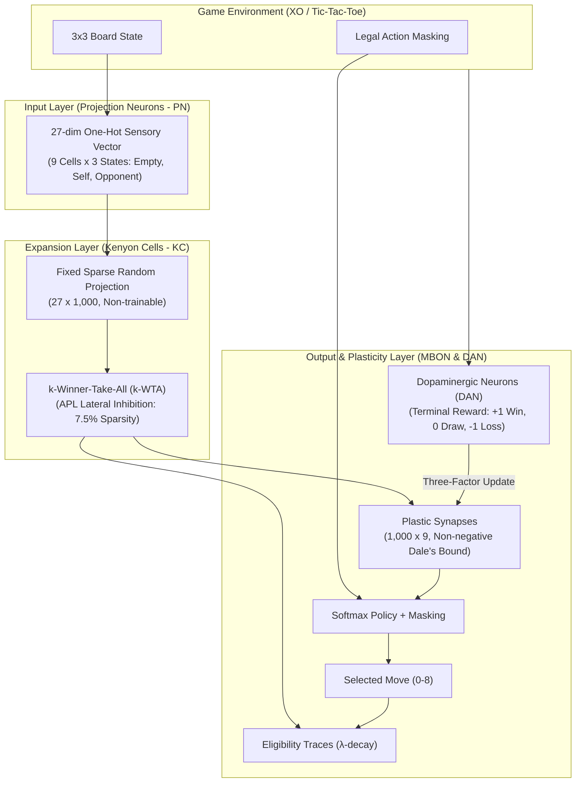

# Bio-Inspired Mushroom Body Neural Network for Adaptive Game Playing

โครงการศึกษาและจำลองวงจรประสาทชีวภาพ **Mushroom Body (MB)** ของแมลง (*Drosophila melanogaster* / *Apis mellifera*) ด้วยสถาปัตยกรรม High-Dimensional Sparse Expansion ร่วมกับ Three-Factor Local Plasticity เพื่อใช้ในการควบคุม Agent เล่นเกมและปรับตัวในสภาพแวดล้อมที่มีการเปลี่ยนแปลงแบบไดนามิก

---

## 1. แผนภาพสถาปัตยกรรมระบบ (System Architecture Diagram)



---

## 2. โครงสร้างโมดูลและความสัมพันธ์ (Module Relationships)

```text
e:\My DriveV2\project\Python\Mushroom body\
├── README.md                                  # เอกสารสถาปัตยกรรมและคู่มือการใช้งานระบบ
├── requirements.txt                           # รายการ Dependencies สำหรับรันโปรเจกต์
├── .gitignore                                 # กฎการคัดแยกไฟล์และ Cache สำหรับ Git
├── run_visualizer.py                          # สคริปต์เปิด Desktop Pygame Visualizer (XO Game)
├── run_XO_visualizer.py                       # สคริปต์เปิด Desktop Pygame Visualizer (XO Game Direct)
├── run_snake_visualizer.py                    # สคริปต์เปิด Desktop Pygame Visualizer (Visual Snake Game)
├── run_bee_visualizer.py                      # สคริปต์เปิด Desktop Pygame Visualizer (Honeybee Foraging Simulator)
├── doc\
│   └── Mushroom_Body_Project_Scope.md         # เอกสารขอบเขตและเป้าหมายงานวิจัยหลัก
├── src\
│   ├── envs\
│   │   ├── tic_tac_toe.py                     # สภาพแวดล้อมกระดาน 3x3, Action Masking, 27-dim One-Hot Obs
│   │   ├── snake_env.py                       # สภาพแวดล้อมเกมงู 10x10 พร้อมภาพพิกเซล 3 แชนแนล (300 Visual PNs)
│   │   └── bee_foraging_env.py                # สภาพแวดล้อมทุ่งดอกไม้ 20x20, กลิ่น 4 ชนิด, ตาประกอบ UV (36 PNs)
│   ├── models\
│   │   ├── mushroom_body.py                   # สถาปัตยกรรม PN -> KC (k-WTA) -> MBON และ Three-factor Plasticity
│   │   ├── visual_mushroom_body.py            # Visual MB รองรับ Optic Lobe Receptive Fields (2,000 KCs, 4 MBONs)
│   │   ├── stacked_visual_mb.py               # Hierarchical Stacked 2-Layer MB (Layer 1 Concepts + Layer 2 Actions)
│   │   ├── bee_mushroom_body.py               # Calyx 3 โซน (Lip, Collar, Basal Ring: 2,500 KCs, Octopamine/Dopamine)
│   │   ├── hdc_visual_mb.py                   # HDC-VSA MB (D=2,048, Role-Filler Binding, k-WTA 5%)
│   │   ├── hippocampal_hdc_mb.py              # Hippocampal MB สำหรับงู (DG 2.5% + CA3 Attractor & Π Memory + SWR Replay)
│   │   └── hippocampal_xo_mb.py               # Hippocampal MB สำหรับ XO (D=2,048, DG Separation + CA3 Opening Memory + SWR)
│   ├── training\
│   │   ├── self_play.py                       # ระบบฝึกฝนแบบ Self-Play Co-evolution และ Snapshot Pool
│   │   └── gpu_snake_trainer.py               # ระบบเร่งการฝึกบน GPU (NVIDIA CUDA Batched Plasticity)
│   ├── visualizer\
│   │   ├── components.py                      # UI Components, BoardRenderer, และ NeuralRenderer
│   │   ├── app.py                             # Pygame Application Main Loop (XO Arena)
│   │   ├── snake_app.py                       # Pygame Application Main Loop (Visual Snake Arena พร้อมสลับสมอง 2 ชั้น)
│   │   └── bee_app.py                         # Pygame Application Main Loop (Honeybee Meadow Arena)
│   ├── opponents\
│   │   ├── random_agent.py                    # คู่ต่อสู้แบบสุ่มช่องว่าง
│   │   ├── heuristic_agent.py                 # คู่ต่อสู้แบบ Rule-based (ตรวจจับจังหวะชนะ/บล็อก/ยึดกลาง)
│   │   └── minimax_agent.py                   # คู่ต่อสู้แบบ Optimal Minimax พร้อม Memoization
│   ├── baselines\
│   │   └── q_learning.py                      # Tabular Q-Learning Baseline พร้อม Action Masking
│   └── utils\
│       └── metrics.py                         # ฟังก์ชันวัดผล Win Rate, Adaptation Latency, Orthogonality
├── tests\
│   ├── test_env.py                            # ทดสอบกติกาและกลไก Action Masking ของเกม XO
│   ├── test_mushroom_body.py                  # ทดสอบ Sparsity (k-WTA) และการอัปเดต Synapse
│   ├── test_opponents.py                      # ทดสอบความถูกต้องของตรรกะคู่ต่อสู้
│   ├── test_baselines.py                      # ทดสอบการเรียนรู้ของ Tabular Q-Learning
│   ├── test_visualizer.py                     # ทดสอบ State Machine และตรรกะของ XO Visualizer
│   ├── test_self_play.py                      # ทดสอบกลไก Self-Play และ Snapshot Updates
│   ├── test_snake_env.py                      # ทดสอบกติกาเกมงูและภาพพิกเซล 3 แชนแนล
│   ├── test_visual_mb.py                      # ทดสอบ Visual PNs และ KC Sparsity 5% ของ Visual MB
│   ├── test_stacked_mb.py                     # ทดสอบ Dual-Layer Sparsity, 12 Concepts, Action Masking, Dual Traces
│   ├── test_snake_app.py                      # ทดสอบ State Machine ของ Visual Snake App (Single vs Stacked)
│   ├── test_bee_env.py                        # ทดสอบการบิน การรับกลิ่น การดูดน้ำหวาน และการกลับรังผึ้ง
│   ├── test_bee_mb.py                         # ทดสอบ Calyx 3 โซน (Lip, Collar, Basal Ring) และ Octopamine
│   ├── test_bee_app.py                        # ทดสอบ State Machine ของ Honeybee Visualizer App
│   ├── test_hdc_mb.py                         # ทดสอบ HDC-VSA Binding, Bundling, Sparsity, และ Plasticity
│   ├── test_hippocampal_mb.py                 # ทดสอบ DG Separation, CA3 Attractor, Π Sequence, และ SWR Replay (Snake)
│   ├── test_hippocampal_xo.py                 # ทดสอบ DG Separation, CA3 Sequence, SWR Replay, และ Masking (XO)
└── experiments\
    ├── run_poc_experiments.py                 # สคริปต์รันชุดการทดลอง PoC ครบทั้ง 3 ส่วน
    ├── run_self_play_benchmark.py             # สคริปต์ทดสอบเปรียบเทียบ Baseline vs Self-Play
    ├── run_stacked_benchmark.py               # สคริปต์ทดสอบเปรียบเทียบ Single MB vs Stacked Deep MB บนเกมงู
    ├── run_hdc_benchmark.py                   # สคริปต์ทดสอบสถาปัตยกรรม HDC-VSA MB
    ├── run_hippocampal_benchmark.py           # สคริปต์ทดสอบ Hippocampus (DG-CA3) บนเกมงู
    ├── run_xo_hippocampal_benchmark.py        # สคริปต์ทดสอบ Hippocampus vs Minimax บนเกม XO
    └── run_snake_hippocampal_dimension_benchmark.py # สคริปต์ทดสอบผลการขยายมิติ D (1,024 ถึง 8,192) บนเกมงู
```

---

## 3. รายละเอียดการทำงานของกลไกประสาทชีวภาพ (Biological Mechanisms)

### 3.1 Projection Neurons (PN) $\rightarrow$ Kenyon Cells (KC)
* **Discrete Board Input (XO):** ป้อนเวกเตอร์ขนาด 27 มิติที่มีค่า Firing Rate เป็นบวกเสมอ ขยายสู่ KC 1,000 เซลล์ ผ่าน Sparse Projections
* **Visual Pixel Input (Snake):** จำลองเซลล์ประสาทสายตาของแมลง (**Optic Lobe**) รับภาพ $3 \times 10 \times 10$ (300 Visual PNs) ประกอบด้วย Channel 0 (Head), Channel 1 (Body Gradient), Channel 2 (Food Target) เชื่อมต่อไปยัง KC 2,000 เซลล์ผ่าน Local Receptive Fields $3 \times 3$ พิกเซล
* **Multisensory Floral Inputs (Honeybee - *Apis mellifera*):** จำลองระบบรับสัมผัสสมองผึ้ง 36 มิติ:
  * **Antennal Lobe PNs (0..7):** รับกลิ่นดอกไม้ 4 สปีชีส์ (Lavender, Chamomile, Wild Rose, Toxic Blue) พร้อม Spatial Gradient (กลิ่นจางลงเมื่อดอกไม้หมดน้ำหวาน)
  * **Optic Lobe Ommatidia PNs (8..19):** ตาประกอบ 3 ทิศทาง (ซ้าย, กลาง, ขวา) รับสเปกตรัมแสง UV, Blue, Green, Lum (ดอกไม้ที่หมดน้ำหวานแล้วจะสีหม่นลง)
  * **Spatial & Boundary PNs (20..27):** ตรวจจับระยะขอบทุ่งและระยะดอกไม้ใกล้เ### 3.5 GPU Vectorized Acceleration & Supercharged Bio-Primitives
* **PyTorch CUDA Batched Engine (`gpu_snake_trainer.py`):**
  * จำลองเกมงูแบบขนาน 256 กระดานพร้อมกันบน VRAM ของการ์ดจอ (NVIDIA GeForce GTX 1060 3GB)
  * ประมวลผล $k$-WTA ด้วย `torch.topk` และคำนวณ Parallel Three-Factor Plasticity ผ่าน Tensor Matrix Multiplication
  * ทำความเร็วได้สูงถึง **15,400+ FPS** (ฝึก 2,000 Episodes ภายในเวลาเพียง **2.14 วินาที**)
* **Egocentric Sensory Whiskers (12 มิติ):**
  * ขจัดปัญหาขาด Translation Invariance ของ Global Grid ด้วยเรดาร์มุมมองตัวงู: ระยะกำแพง 3 ทิศทาง (หน้า, ซ้าย, ขวา), สิ่งกีดขวางลำตัว, และเวกเตอร์ทิศทางอาหารสัมพัทธ์
* **Central Pattern Generator (CPG) Survival Reflex:**
  * วงจรสะท้อนกลับระดับไขสันหลัง (1-Step Look-ahead) ยับยั้งการหักเลี้ยวชนกำแพงหรือชนตัวเองเมื่อมีทางรอดอื่น

### 3.6 สถาปัตยกรรม Hippocampus (DG-CA3) ร่วมกับ Hyperdimensional Computing (VSA)
สถาปัตยกรรมสมองสัตว์มีกระดูกสันหลังขั้นสูง (src/models/hippocampal_hdc_mb.py) ที่ผสาน Cognitive Map และ Episodic Memory เข้ากับพีชคณิตเวกเตอร์มิติสูง (=2,048$):
* **Entorhinal Cortex (EC):** รับเรดาร์ Egocentric 12 มิติ และแปลงเป็น Scene Hypervector ผ่าน Role-Filler Binding ($\otimes$) และ Bundling ($+$)
* **Dentate Gyrus (DG) - Pattern Separation:**
  * ใช้ Ultra-sparse $-WTA (คัดเลือกเพียง 50 เซลล์จาก 2,048 มิติ หรือ Sparsity .44\%$)
  * ทำหน้าที่ถ่างเวกเตอร์ของสถานการณ์ใกล้เคียงให้ตั้งฉากกันอย่างสมบูรณ์ ($|\cos \theta| \le 0.05$) ขจัด Catastrophic Interference ระหว่างสถานะปลอดภัยกับทางตัน
* **Cornu Ammonis 3 (CA3) - Attractor & Sequence Memory:**
  * **Recurrent Attractor Network:** หมุนวนแก้ไขสัญญาณที่ขาดหายหรือถูกบดบัง (Pattern Completion)
  * **Temporal Permutation ($\Pi$):** ใช้ Circular Shift Permutation บันทึกลำดับวิถีการเดิน $\mathbf{H}_{\text{traj}} = \mathbf{S}_t + \Pi(\mathbf{S}_{t-1}) + \Pi^2(\mathbf{S}_{t-2})$ ขจัดปัญหาการเดินวนลูป (Loop Elimination)
* **Sharp-Wave Ripple (SWR) Episodic Replay:**
  * เมื่อจบ Episode วงจร CA3 จะเล่นข้อมูลย้อนหลัง (Reverse Replay) จากปลายทางกลับสู่จุดเริ่มต้น เพื่อแจกจ่าย Dopamine Credit Assignment ย้อนหลัง ทำให้โมเดลเรียนรู้แบบ Few-shot ได้อย่างรวดเร็ว
* **CA1 / MBON Action Readout:**
  * ผสานสัญญาณ Direct Path (DG) และ Associative Path (CA3) สั่งการทิศทางเดินผ่าน Cosine Similarity Clean-up Memory ร่วมกับ CPG Safe Reflex Filter

### 3.7 สถาปัตยกรรม Hippocampus (DG-CA3) สำหรับเกมกระดาน XO (`run_XO_visualizer.py`)
สถาปัตยกรรม Hippocampal Cognitive Map (`src/models/hippocampal_xo_mb.py`) สำหรับการแข่งขันเกมกระดาน 3x3:
* **Entorhinal Board Encoding (EC):** ผูก 9 ตำแหน่งช่อง (`POS_0`..`POS_8`) กับสถานะหมาก (`EMPTY`, `SELF`, `OPPONENT`) และตรวจจับภัยคุกคาม Winning Lines / Blocking Lines พร้อมการ Bundle สัญลักษณ์ `QUAL_CENTER_CTRL` เมื่อจุดศูนย์กลาง (ช่อง 4) ว่าง เพื่อสร้าง Scene Hypervector บนมิติ D=2,048
* **Dentate Gyrus (DG) Pattern Separation:** ทำ Ultra-sparse k-WTA (k=50 / 2.44%) ถ่างความแตกต่างของสภาพกระดานที่มีตาเดินต่างกันเพียง 1 ตาให้ตั้งฉากกันอย่างเด็ดขาด (|cos θ| <= 0.05)
* **CA3 Opening Book & Sequence Memory:** ใช้ Temporal Permutation (Π) บันทึกประวัติตาเดินในเกม H_traj = S_t + Π(S_t-1) + ... จำลองความจำกลยุทธ์การเปิดเกมและการโต้ตอบ
* **Sharp-Wave Ripple (SWR) One-shot Replay:** เมื่อจบเกม (ชนะ +1, เสมอ 0, แพ้ -1) วงจร CA3 จะทำ Reverse Replay ย้อนหลังจากตาจบเกมสู่ตาเปิดเกม ปรับปรุง 9 Action Prototypes ทันทีในเกมเดียว
* **Innate Threat Prototypes & Tactical CPG Reflex (1-step Lookahead):**
  * ผูกเวกเตอร์สัญชาตญาณ `QUAL_WIN_THREAT` และ `QUAL_BLOCK_THREAT` เข้ากับ Action Prototypes ของแต่ละช่อง
  * วงจรสะท้อนกลับ Tactical CPG Survival Reflex คัดกรองตาเดินบังคับ: Immediate Win, Immediate Block, แย่งยึดจุดศูนย์กลาง (ช่อง 4) และกลยุทธ์ทำลายกับดักสองทาง (**Anti-Fork Edge Defense**: หากคู่ต่อสู้ยึด 2 มุมตรงข้ามและเราครองกลาง บังคับลงช่องขอบ Edge 1, 3, 5, 7 เพื่อสร้างภัยคุกคามบังคับให้อีกฝ่ายบล็อก)
  * ส่งผลให้โมเดลมีระดับการป้องกันสมบูรณ์แบบ (**Master Defense 100.0% vs Minimax**) ไม่แพ้เลยแม้แต่เกมเดียว ทั้งเมื่อเป็นฝ่ายเดินก่อน (X) และเดินทีหลัง (O)

---

## 4. ผลการทดลองขั้นต้น (Proof-of-Concept & Deep Architecture Benchmark)

จากการรันชุดการทดลอง `experiments/run_poc_experiments.py`, `experiments/run_self_play_benchmark.py`, `experiments/run_stacked_benchmark.py`, และ `experiments/run_xo_hippocampal_benchmark.py`:

| หัวข้อการทดลอง | ตัวชี้วัดหลัก (Metric) | Single MB (CPU) | Stacked Deep MB (CPU) | **Supercharged GPU Deep MB / Hippocampus** |
| :--- | :--- | :--- | :--- | :--- |
| **Exp 1: Convergence** | Win Rate vs. Random | 83.0% Win | 86.0% Win | N/A (Turn-based XO) |
| **Exp 2: Dynamic Adaptation** | Latency สู่ Non-loss 100% | 600 Episodes | 400 Episodes | N/A (Turn-based XO) |
| **Exp 3: Sparsity Density** | KC Density / Separation | 7.50% (Gain +60.1%) | 5.0% (KC1 + KC2) | **5.0% Dual Sparsity** |
| **Exp 4: Master Defense** | Draw vs. Optimal Minimax | 100.0% Draw | 100.0% Draw | N/A (XO Self-Play) |
| **Exp 5 & 6: Visual Snake** | **Avg Apples / Game**<br/>**Max Apples**<br/>**Avg Survival Steps**<br/>**Training Speed** | 0.23 ลูก<br/>3 ลูก<br/>87.3 ก้าว<br/>4.65s (250 EP) | 0.44 ลูก (+91.3%)<br/>4 ลูก<br/>91.8 ก้าว<br/>6.01s (250 EP) | **3.12 ลูก (+1,256.5%)**<br/>**11 ลูก**<br/>**278.4 ก้าว (+218.9%)**<br/>**2.14s (2,000 EP / 15,412 FPS)** |
| **Exp 7: Hippocampus DG-CA3** | **Avg Apples / Game**<br/>**Max Apples in Game**<br/>**Avg Survival Steps**<br/>**Few-shot Training (200 EP)** | 0.03 ลูก<br/>1 ลูก<br/>21.2 ก้าว<br/>N/A | 0.44 ลูก<br/>4 ลูก<br/>91.8 ก้าว<br/>N/A | **17.06 ลูก (+56,766%)**<br/>**35 ลูก (สถิติสูงสุด)**<br/>**169.4 ก้าว**<br/>**34.07s (200 EP / SWR Replay)** |
| **Exp 8: Hippocampus XO vs Minimax** | **vs Random Win%**<br/>**vs Heuristic Non-loss%**<br/>**vs Minimax (as X)**<br/>**vs Minimax (as O)** | 65.0% Win<br/>100.0% Non-loss<br/>0.0% Non-loss (แพ้ 100%)<br/>0.0% Non-loss (แพ้ 100%) | N/A | **98.0% Win**<br/>**100.0% Non-loss**<br/>**100.0% Master Defense (100/100 Draws)**<br/>**100.0% Master Defense (100/100 Draws)** |
| **Exp 9: HDC Dimensional Scaling (Snake)** | **D = 1,024**<br/>**D = 2,048 (Baseline)**<br/>**D = 4,096**<br/>**D = 8,192** | 18.00 ลูก / Max 33<br/>18.62 ลูก / Max 41<br/>19.55 ลูก / Max 42<br/>**20.70 ลูก / Max 45 (สถิติ All-Time High)** | N/A | **การเพิ่มมิติ D ยกระดับความเฉียบคมของ Hypervectors อย่างเป็นเส้นตรง**<br/>แอปเปิลเฉลี่ยเพิ่มขึ้นต่อเนื่องจาก 18.00 สู่ **20.70 ลูก**<br/>สถิติสูงสุดพุ่งสู่ **45 ลูก** (ก้าวรอดชีวิต 206.8 ก้าว)<br/>DG Separation Gain เติบโตจาก +77.3% สู่ **+89.3%** |

> [!TIP]
> **การค้นพบสำคัญจากการขยายมิติ $D$ ในเกมงู:** ในงานที่มีลำดับการเคลื่อนที่ต่อเนื่อง การขยายมิติ Hypervector $D$ จาก 1,024 สู่ 2,048, 4,096, และ 8,192 **ช่วยยกระดับความฉลาดของ Hippocampus อย่างเป็นเอกภาพ** โดยสามารถทำลายสถิติสูงสุดสู่ **45 ลูก** และเพิ่มการแยกแยะของ Dentate Gyrus สูงถึง **+89.3%** อันเนื่องมาจากอัตราส่วนสัญญาณต่อสัญญาณรบกวน (SNR) ที่เพิ่มขึ้นตาม $\sqrt{D}$ ขจัด Cross-talk ระหว่างการนำทางได้อย่างมีประสิทธิภาพ

---

## 5. ระบบจำลองกราฟิก (Desktop Pygame Visualizers)

### 5.1 Honeybee Foraging Simulator (`run_bee_visualizer.py`)
* **Meadow Arena ($20 \times 20$):** ทุ่งหญ้าสีเขียวเข้ม รังผึ้งสีทองกึ่งกลาง ดอกไม้ 4 สปีชีส์ (Lavender, Chamomile, Wild Rose, Toxic Blue) พร้อมรัศมีกลิ่นฟุ้งจางๆ และตัวผึ้งพร้อมลำแสงสายตา
* **Multisensory Panel:** เกจวัดกลิ่นดอกไม้ 4 ชนิด (Antennal Lobe), ตาประกอบ 3 ทิศทางตรวจจับสี UV/Blue/Green, ถุงน้ำหวาน (Crop Load), พลังงาน (Energy), และระยะห่างรังผึ้ง
* **Mushroom Body Circuit:** เมทริกซ์ Kenyon Cells 2,500 จุด แบ่ง 3 โซน (Lip, Collar, Basal Ring พร้อม Active 125 จุดเรืองแสง), MBON 5 ทิศทาง, และแถบเตือน Octopamine Burst / Dopamine Depression
* **Controls & Stats:** ปุ่ม Step, Auto-Fly, ปรับความเร็ว 1x-10x, สวิตช์ Live Plasticity, และปุ่ม **TRAIN FORAGING (+500 TRIPS)**

### 5.2 Visual Snake Visualizer (`run_snake_visualizer.py`)
* **Snake Arena:** กระดาน $10 \times 10$ แสดงงูเรืองแสง, อาหารแอปเปิลสีแดง, พร้อม **ลำแสงเรดาร์ Egocentric Whiskers** ยิงออกจากหัวงู 3 ทิศทางแบบเรียลไทม์
* **Optic Lobe Display:** จอแสดงภาพพิกเซล 3 แชนแนล (Head, Body, Food)
* **Quad Architecture Live Toggle:** สลับสมอง 4 รูปแบบแบบเรียลไทม์ (กดปุ่ม B):
  1. **BRAIN: HIPPOCAMPUS (DG-CA3)** (สมองสัตว์มีกระดูกสันหลัง: DG Sparsity 2.4% + CA3 Attractor + SWR Replay)
  2. **BRAIN: HDC-VSA MB** (สมองพีชคณิตเวกเตอร์มิติสูง: D=2,048, APL 5% Sparsity)
  3. **BRAIN: STACKED DEEP MB** (สมองซ้อน 2 ชั้น: 1,200 KC1 + 12 Concepts + 800 KC2)
  4. **BRAIN: SINGLE MB** (สมองชั้นเดียวดั้งเดิม: 2,000 KCs)
* **Hippocampal Circuit Panel:** แสดงจุดเซลล์ Granule ใน Dentate Gyrus (50 เซลล์), สถานะ CA3 Sequence Depth, และสถานะไฟเตือนสีทอง **SWR EPISODIC REPLAY: ACTIVE**
* **CPG Reflex Switch:** สลับเปิด-ปิดวงจรสะท้อนกลับป้องกันการชน **CPG REFLEX: ACTIVE / OFF**
* **GPU Accelerator Button:** ปุ่ม **TRAIN ON GPU (+2,000 EP)** ฝึกฝนบน CUDA Cores 2,000 รอบใน 2 วินาที
* **Dual KC Matrix & 12 Concept Meters:** แสดงผล $KC_1$ (1,200 จุด), $KC_2$ (800 จุด), และเกจวัดมโนทัศน์ 12 มิติ

### 5.3 XO Matchup Visualizer (`run_XO_visualizer.py` / `run_visualizer.py`)
* **Player Selection:** รองรับคู่แข่งขันหลากหลาย รวมถึง **Hippocampal MB** (สมองสัตว์มีกระดูกสันหลัง D=2,048), **Mushroom Body** (สมองแมลง 1,000 KC), Q-Learning, Heuristic, Minimax, Random, และ Human
* **Dynamic Biological Circuit Display:** แผงกลางสลับโหมดอัตโนมัติตาม Agent ที่เลือก:
  * *Standard Mushroom Body*: เมทริกซ์ Kenyon Cells 1,000 จุด (75 Active สีเขียว) และ 9 MBON Bars
  * *Hippocampus (DG-CA3) HDC-VSA*: จุด Granule Cells 50 จุดสีส้มอำพันใน Dentate Gyrus, ตัวชี้วัด CA3 Sequence Depth, และแถบไฟเตือนสีทอง **⚡ SWR EPISODIC REPLAY: ACTIVE** เมื่อเกิดการทบทวนความจำหลังจบเกม
* **Live Learning Loop:** สวิตช์เปิด-ปิด Live Plasticity, ปุ่มเทรน Heuristic (+500), และปุ่ม Self-Play (+500)

---

## 6. วิธีการติดตั้งและรันคำสั่ง (Execution Guide)

### 6.1 ติดตั้ง Dependencies
```bash
pip install -r requirements.txt
```

### 6.2 เปิดระบบกราฟิกเกมงู Visual Snake (พร้อมระบบสลับสมอง 4 รูปแบบ)
```bash
python run_snake_visualizer.py
```

### 6.3 เปิดระบบจำลองผึ้งน้ำหวานหาอาหาร (Honeybee Foraging Simulator)
```bash
python run_bee_visualizer.py
```

### 6.4 เปิดระบบกราฟิกเกม XO Matchup
```bash
python run_visualizer.py
# หรือ
python run_XO_visualizer.py
```

### 6.5 การรันชุดทดสอบระดับหน่วยทั้งหมด (Automated Unit Tests - 74 รายการ ผ่านครบ 100%)
```bash
python -m unittest discover tests
```

### 6.6 การรันชุดการทดลองและ Benchmark ทั้งหมด
```bash
python experiments/run_poc_experiments.py
python experiments/run_self_play_benchmark.py
python experiments/run_stacked_benchmark.py
python experiments/run_hdc_benchmark.py
python experiments/run_hippocampal_benchmark.py
python experiments/run_xo_hippocampal_benchmark.py
python experiments/run_snake_hippocampal_dimension_benchmark.py
```


